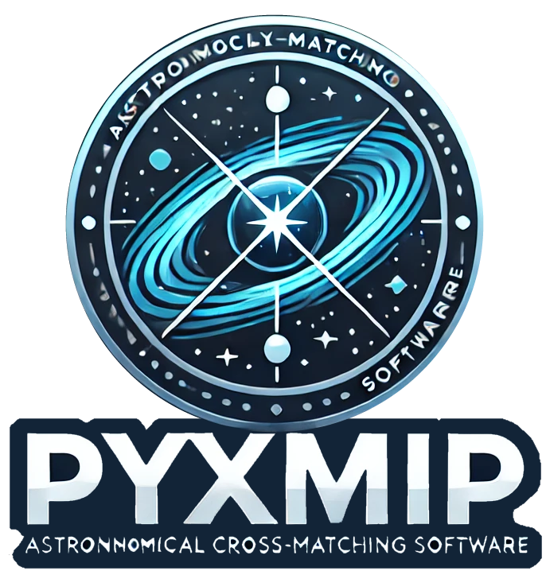

|precom| |linting| |docs| |isort Status| |black| |astropy| |astroQuery| |sklearn|

pyXMIP (the python X-Matching and Identification Package) is an astronomical software package for cross referencing source catalogs
against known databases. The package provides a variety of statistical tools for quantifying the confidence of a given match and automates
queries against many of the most common astronomical databases.

.. raw:: html

   

Features
========

- Cross match catalogs of sources from survey missions against a wide array of known source databases.
- Use statistical methodologies to model the distribution of sources and produce match probabilities.
- Create mock all sky surveys.

Installation
============

.. |docs| image:: https://img.shields.io/badge/docs-latest-brightgreen.svg
   :target: https://eliza-diggins.github.io/pyXMIP
.. |precom| image:: https://img.shields.io/badge/pre--commit-enabled-brightgreen?logo=pre-commit
   :target: https://github.com/pre-commit/pre-commit
.. |linting| image:: https://img.shields.io/badge/linting-Flake8-brightgreen.svg?style=flat
.. |Github Page| image:: https://github.com/eliza-diggins/pyXMIP/actions/workflows/build_docs.yml/badge.svg
.. |isort Status| image:: https://img.shields.io/badge/%20imports-isort-%231674b1?style=flat&labelColor=ef8336
    :target: https://pycqa.github.io/isort/
    :alt: isort Status
.. |black| image:: https://img.shields.io/badge/code%20style-black-000000.svg
    :target: https://github.com/psf/black
.. |astropy| image:: http://img.shields.io/badge/powered%20by-AstroPy-orange.svg?style=flat
    :target: https://www.astropy.org
.. |astroquery| image:: http://img.shields.io/badge/powered%20by-AstroQuery-orange.svg?style=flat
    :target: https://www.astropy.org
.. |sklearn| image:: http://img.shields.io/badge/powered%20by-sklearn-cyan.svg?style=flat
    :target: https://scikit-learn.org/stable/index.html
.. |NED| image:: images/logos_icons/NED.png
    :scale: 20%
    :target: https://ned.ipac.caltech.edu
.. |SIMBAD| image:: images/logos_icons/SIMBAD.jpg
    :scale: 20%
    :target: https://simbad.cds.unistra.fr/simbad/
